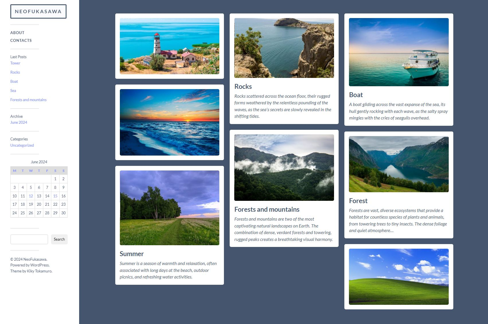

# NeoFukasawa

NeoFukasawa is a minimal style blog theme based on [Fukasawa](https://andersnoren.se/teman/fukasawa-wordpress-theme/).
It features responsive & retina-ready design, Block Editor support, support for the image, gallery and video post formats, four custom widgets, an archive page template, a gallery slideshow, custom accent color support, custom logo support, editor styles, and much more.

## Installing NeoFukasawa
1. Download the latest stable version of NeoFukasawa through the link above, unzip it and upload the theme folder to `wp-content/themes/` in your WordPress installation. You can also install it through Themes → Add New in your WordPress installation.
2. Activate the theme.

## Contributing
Do you have a bug report or feature request? Feel free to create an issue, and I’ll take a look at it. You can also create a pull request if you have a solution ready. 

## Requirements
- WordPress 4.5+
- PHP 5.4+
- License: [GPLv2](https://www.gnu.org/licenses/gpl-2.0.html) or later